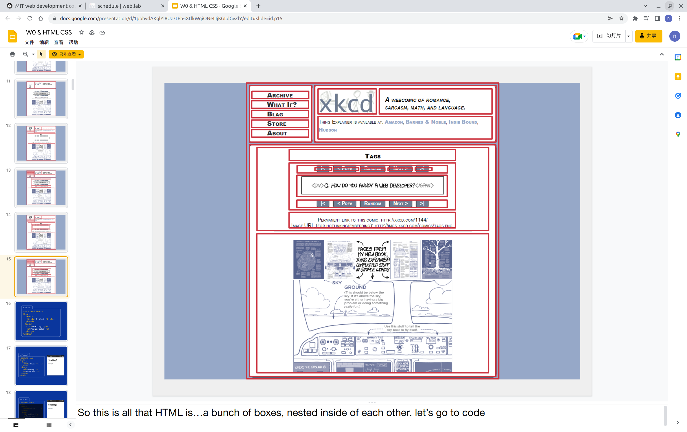

## Intro to Git/Github

git : a vision control system

### what git do?
git track changes(how? math!)
比如对于一个version1，新增了一行并commit，在MATH中可以表现为
```
+ content you add
@Line 4
```
如果继续又删除了一行，就是
```
- content you del
@ Line3
```

### some command line use
cp file1 file2 //备份
mv file1 file2 //重命名
rmdir - 删除文件夹，但是只能删除空文件夹

## Intro to HTML/CSS

### HTML

the `language` your web browser uses to `describe the content and structure` of the web pages

**html = nested boxes**


#### html structure
+ Document
  + Root element (<!DOCTYPE html>)
    + body - a , href , h1
    + head - title(Text)

#### html tags
+ Insert Links
  `<a href="the.link.url"> Link to the.link.url!</a>`
+ Insert Image
  ``
+ Lists
  `<ol>` Ordered List(1,2,3...)
  `<ul>` Unordered List(·)
  `li` List item
  ```
  <ul>
    <li>Item 1</li>
    <li>Item 2</li>
  </ul>
  ```
+ `<div>` - Blick Section inDocument
+ `<span>` - inline Section in document

#### learning tool_website
MDN IS GREAT

### CSS

the `rules` that tell your web browser `how stuff looks`

**CSS = A list of description**

#### CSS ruleset
```
div{ //selector
    color: red;  //property: value
    font-family: Arial;
    font-size: 24pt;
}
```
#### CSS and HTML
```
html:
    <div class="info">info</div>
css:
    .info{
        property: value;
    }
```
```
html:
    <div id="info">info</div>
css:
    #info{
        property: value;
    }
```
**Only use classes for CSS styling!**

### combining HTML and CSS
```
<link rel="stylesheet"
      href="style.css"/>
```

add a `navbar` at the top of our navbar content
```
<nav class="navContainer">
  <h1 class="navTitle">Catbook</h1>
</nav>
```

CSS Variables - 可以定义的CSS变量，可用于定义颜色
```
:root{
  --primary: #396dff
  --grey: #f7f7f7
  --white: #fff
}

.navTitle{
  color: var(--primary);
}
```

#### the void
void就是比如一个背景条，它的两端会有很小的地方和页面的两端是空白的，需要充满它

`box model` - MARGIN(8px) - BORDER(0px) PADDING(0px) CONTENT
+ MARGIN - box的最外层,与页面中间
+ BORDER - box的界线，可以调整线条宽度
+ PADDING - BORDER与CONTENT之间的空白宽度
```
<div class="box">
  content
</div>

.box{
  margin: 0px;
  border: 1px solid black;
  padding: 10px;
}
```
**margin: 10px 20px 30px 40px (分别指定上、右、下、左四个方向的margin宽度)**


### find fonts at fonts.google.com